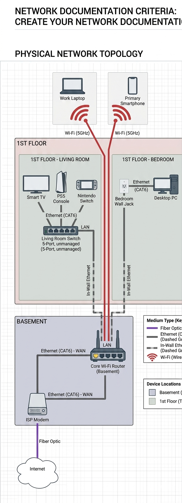

# Home Network Documentation

This document provides a detailed record of the physical layout, logical structure, device configuration, and security management guidelines for the home network, and is intended for network maintenance and troubleshooting.

## 1. Physical Topology

1. __Network Topology Diagram__
   
    Below is the comprehensive visualization of the home network's physical topology, showing device locations, connections, and medium types.
   
3. __List of Physical Equipment__
   
   Basement:
      1. ISP Modem: The service provider’s in-home access point.
      2. Main Router: TP-Link AX6000, responsible for core internet connectivity and whole-home Wi-Fi coverage.
         
   Living Room:
      1. 5-Port Switch
      2. Smart TV
      3. PS5
      4. Switch
         
   bedroom:
      1. Laptop
      2. Smartphone
         
   Cat6 Ethernet cables connect the TV, PS5, and Switch.

## Logical Topology

   1. Network topology diagram: Shows subnets, VLANs, and data flow.
      
   
   
   2.  table

      | Device Name | Physical Location | Interface/Port | Cable Type | Connected To | IP Address |
      | :--------- | :----------------- | :--------------| :--------- | :----------- | :--------- |
      | ISP Modem	| Basement | Optical Port | Fiber Optic | Internet (External) | Public IP | 
      | ISP Modem	| Basement | LAN Port 1	| Cat6 Ethernet	| Core Router (WAN)	| 192.168.0.1 | 
      | Core Wi-Fi Router	| Basement| WAN Port	| Cat6 Ethernet	| ISP Modem	| 192.168.1.1 (Gateway) |
      | Core Wi-Fi Router	| Basement	| LAN Port 1	| In-Wall Cat6	| LR Switch (Uplink)	| N/A  |
      | Core Wi-Fi Router	| Basement | LAN Port 2	| In-Wall Cat6	| Bedroom Wall Jack	| N/A  |
      | Living Room Switch	| 1st Floor	| Uplink Port	| In-Wall Cat6	| Core Router | 192.168.1.2 |
      | Smart TV	|1st Floor 	| Ethernet Port	| Cat6 Patch	| Living Room Switch	| 192.168.1.21 |
      | PS5 Console	| 1st Floor	| Ethernet Port	| Cat6 Patch	| Living Room Switch	| 192.168.1.22 |
      | Nintendo Switch	| 1st Floor | Ethernet Port	| Cat6 Patch	| Living Room Switch	| 192.168.1.23 |
      | Desktop PC	| 1st Floor | Ethernet Port	| Cat6 Patch	| Bedroom Wall Jack	| 192.168.1.30 |
      | Work Laptop	| 1st Floor |	Wi-Fi Antenna	| Wireless | Core Router 5Gh| 192.168.1.50 |
      | Primary Smartphone	| 1st Floor | Wi-Fi Antenna	| Wireless	| Core Router 5Gh| 192.168.1.60 |

## Devices & Services
  | Device Category | Brand & Model | Role | Firmware OS | 
  | :--------- | :----------------- | :--------------| :--------- |
  | ISP Modem | Arris BGW210 | Gateway / Fiber ONT | Manufacturer Default |
  | Core Router | ASUS RT-AX86U | Main Router & Wi-Fi AP | ASUSWRT (v3.0.0.4) |
  | Network Switch | TP-Link TL-SG105 | Living Room Distribution | Unmanaged (Plug & Play) |
  | Desktop PC | Custom Build | Workstation / Media Host | Windows 11 Pro |
  | Gaming Console | Sony PlayStation 5 | Media / Gaming Client | System Software 24.0x |

## Device Configuration

1. DNS Services (Domain Name System)
   
   1. Primary DNS: 1.1.1.1 - Used for fast, private browsing.
   2. Secondary DNS: 8.8.8.8 - Used as a reliable backup.
   3. Local DNS: Managed by the Core Router, resolving local hostnames for easier internal access.
      
2. DHCP & IP Management
   
   1. DHCP Server: Handled by the Core Router.
   2. IP Range: 192.168.1.100 to 192.168.1.254.
   3. Static Reservations: Assigned to the Desktop PC (.30) and PS5 (.22) to ensure consistent connectivity for port forwarding.
      
4. Network Storage (NAS / Storage)
   
   1. Primary Storage: A 4TB Western Digital Blue HDD is hosted on the Desktop PC.
   2. File Protocol: SMB (Server Message Block) is enabled, allowing the Work Laptop and Smart TV to access shared media and backup folders over the local network.
   3. Cloud Backup: Critical documents are synced from the PC to OneDrive/GitHub for off-site redundancy.
      
6. Security Services
   
   1. Firewall: SPI (Stateful Packet Inspection) enabled on the Core Router to block unsolicited inbound traffic.
   2. UPnP: Disabled for security; manual Port Forwarding is used for PS5 (Port 3478-3480) to achieve NAT Type 1/2.
   
## Security & Credentials

   1. Recommended approach: I never store any passwords in plain text on GitHub or in local text files. I use an encrypted password manager like Bitwarden to store all router admin passwords and Wi-Fi keys.
   2. Two-factor authentication: I have enabled 2FA to enhance reliability and security.”

